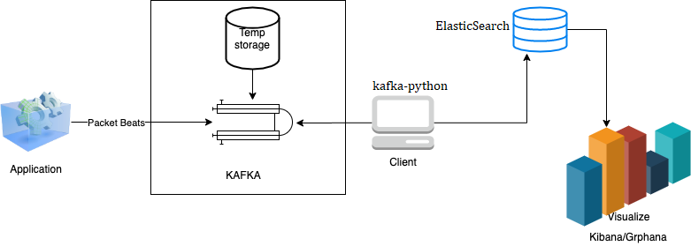

# tvarit-hackathon

## Architecture

## Establish connection with Kafka: 
Python package kafka-python was used to establish connection with KAFKA and consume data from it.

## Landing Zone: Elasticsearch 
Subsequently, data was pushed onto Elasticsearch DB using python package elasticsearch.
This was ensured by installing elasticsearch on an ec2 instance using docker.

## Visualization Tool - Kibana and Grafana
Kibana was installed on the AWS instance and reverse proxy was done to ensure it was accessible via HTTP.

## References
- https://www.elastic.co/elasticsearch/
- https://github.com/darenr/python-kafka-elasticsearch
- https://towardsdatascience.com/kafka-python-explained-in-10-lines-of-code-800e3e07dad1
